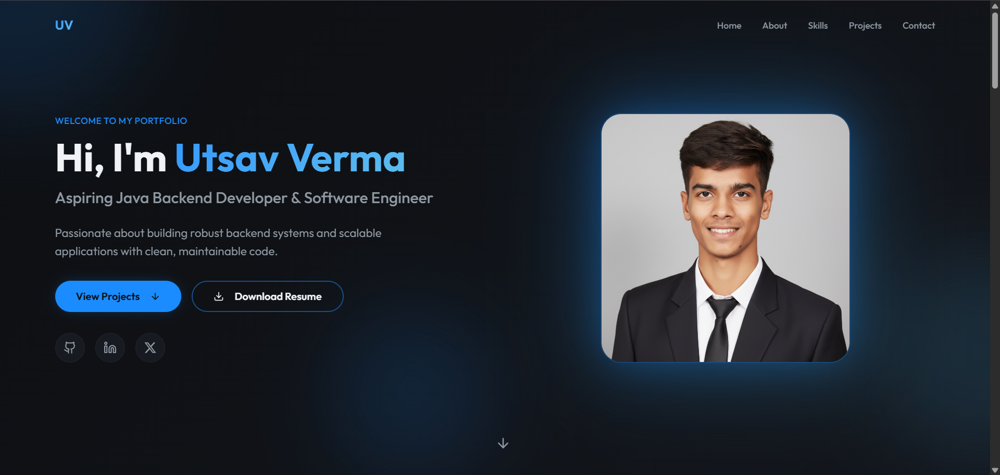

# 🌐 Utsav Verma – Java Backend Developer Portfolio

Welcome to my developer portfolio 👋  
This repository contains the source code for my **personal portfolio website**, showcasing my backend-focused projects, technical skills, and learning journey as a **Java Backend Developer**.

---

## 🚀 About Me

I am a **Java Backend Developer** with a strong interest in building **scalable, secure, and well-structured backend systems**.  
My focus is on **Spring Boot, RESTful APIs, database design, and clean architecture**.

I am currently preparing for **backend internships and fresher software engineering roles** by building real-world projects and improving my **DSA and system design fundamentals**.

---

## 🛠️ Tech Stack

- **Language:** Java  
- **Backend:** Spring Boot, REST APIs  
- **ORM:** Hibernate / JPA  
- **Database:** PostgreSQL  
- **Security:** JWT-based authentication  
- **Tools:** Git, GitHub, Postman  
- **Frontend (Portfolio):** HTML, CSS, JavaScript  

---

## 📂 Featured Projects

### 🔹 Hirely – Job Recruitment Portal
A backend-driven recruitment platform that connects recruiters and job seekers through secure REST APIs.

**Key Features:**
- Job posting & application management  
- Role-based access control  
- Clean layered architecture  

**Tech Used:** Java, Spring Boot, Hibernate/JPA, PostgreSQL  

---

### 🔹 TaskFlow – Task Management System
A REST API–based task management system for creating, updating, and tracking tasks.

**Key Features:**
- CRUD operations for tasks  
- Task status tracking  
- Global exception handling  

**Tech Used:** Java, Spring Boot, PostgreSQL  

---

### 🔹 E-Commerce REST API
A backend-only e-commerce system handling product, cart, and order workflows.

**Key Features:**
- Product & order management  
- Database-driven workflows  
- Modular and scalable design  

**Tech Used:** Java, Spring Boot, Hibernate/JPA, PostgreSQL  

---

## 📸 Portfolio Preview

The portfolio website presents:
- Project cards with descriptions  
- Technology tags  
- Direct links to GitHub repositories  

> 


---

## ⚙️ How to Run Locally

```bash
# Clone the repository
git clone https://github.com/utsavverma-dev/My-Portfolio.git

# Install dependencies and run locally
npm install
npm run dev
```
---

## 🎯 Goals
Build production-ready backend projects

Improve API design and system architecture

Secure a Java Backend Intern / Fresher role

---

## 📬 Contact
GitHub: https://github.com/utsavverma-dev

LinkedIn: https://www.linkedin.com/in/utsav-verma-928886308/
